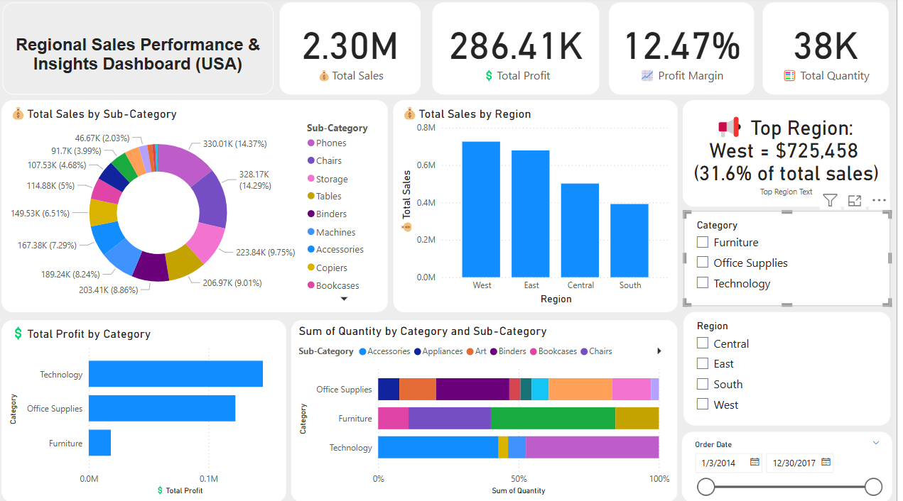

# 📊 Regional Sales Performance Dashboard

## 🧩 Project Overview

The Regional Sales Performance & Insights Dashboard (USA) is an interactive Power BI report that visualizes key sales metrics across U.S. regions. It highlights total sales, profit, margin, and quantity, with dynamic filters for region, category, and date. Users can quickly identify top-performing regions, high-profit categories, and top-selling sub-categories to support strategic decision-making.

---

## 💡 Features

- Sales & Profit breakdown by region, category and Sub-Category
- Quantity distribution across Categories/sub-categories
- Slicers for dynamic filtering (Region, Category, Date)
- Clear callouts like Top Region & Margin percentage

---

## 🛠️ Tools & Technologies

- **Power BI Desktop**
- **Power Query** for data transformation
- **DAX** for calculated columns and measures
- Sample sales dataset

---

## 📸 Dashboard Preview

---

## 📁 Project Files

- `Business Analyst Project - Sanuvi Sonnadara.pdf` - Report
- `Business Analytics Project.pbit` - Power BI template file
- `README.md` - Project documentation

---

## 📌 How to Use

1. Download and open the `.pbix` or `.pbit` file in Power BI Desktop.
2. Explore the dashboard by using slicers and filters.
3. Modify or extend the dataset and visuals as needed.

---

## ✍️ Author

**Sanuvi** – Aspiring Business Analyst | Data Enthusiast  
Connect on [LinkedIn](https://www.linkedin.com/in/sanuvisonnadara/) | Contact: [sanuvisonnadara@gmail.com]

---

## 📄 License

This project is open-source and available for learning and portfolio use. Please credit the author when using parts of it publicly.

